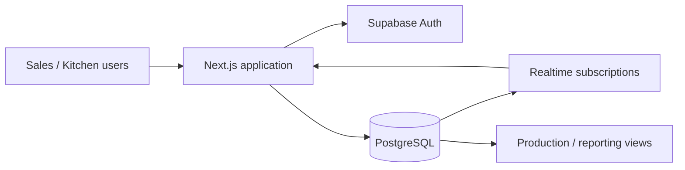

# BakeryOps — Order & Production Management

An anonymized portfolio edition of a production web application built collaboratively for a real artisan-bakery client. The original system replaced manual order tracking with a shared workflow for sales, kitchen production, payments, reservations and operational reporting.

> **Privacy note**
> Real customer records, phone numbers, addresses, commercial pricing and client branding were removed from this public edition. All demo records in this repository are synthetic.

## Why this project matters

This was not a tutorial project. It was designed around a real operational workflow and used to coordinate orders between sales and production. The project required translating non-technical requirements into a data model, building the application end-to-end, and iterating on the system as the workflow evolved.

## Stack

- **Next.js / React / TypeScript** — App Router UI and server components
- **Supabase / PostgreSQL** — database, authentication and realtime updates
- **Row Level Security** — database-level access controls
- **Tailwind CSS** — responsive UI
- **date-fns / Lucide** — scheduling and interface utilities

## Core functionality

- Order lifecycle management and order-number tracking
- Customer and product management
- Reservations that can be converted into orders
- Partial/full payment history
- Product bundles and discounts
- Daily/weekly production planning
- Calendar views
- Expense and revenue summaries
- Realtime updates between users
- Role-aware profiles (`admin`, `ventas`, `cocina`)
- Printable order and production views

## Architecture



The database keeps order-item price snapshots so historical orders remain stable even when catalog prices change. Database triggers maintain derived totals, and realtime subscriptions refresh order/production views when operational data changes.

## Security & anonymization

The original project contained production data that must never be public. This portfolio edition therefore:

- removes all real customer seed data;
- replaces business-specific products/prices with synthetic demo data;
- removes client logos and email-domain assumptions;
- moves Turnstile configuration to environment variables;
- adds a hardening migration that prevents self-assigned role escalation and enforces role-based RLS.

## Local setup

1. Create a Supabase project.
2. Apply the SQL files in `supabase/migrations/` in numeric order.
3. Optionally apply `supabase/demo_seed.sql`.
4. Copy `.env.example` to `.env.local` and fill in the public Supabase URL/anon key.
5. Install and run:

```bash
npm install
npm run dev
```

Open `http://localhost:3000`. Create users from Supabase Auth and assign their profile role from the database/admin tooling.

## Repository scope

This repository is a **sanitized portfolio snapshot** of a collaborative client project. It intentionally omits production credentials, real customer data, private client assets and business-specific datasets.

## What I worked on

My work on the project included translating client needs into technical requirements, developing and maintaining the application, structuring operational data, automating previously manual workflows, and iterating on the delivered system with the team and client.
