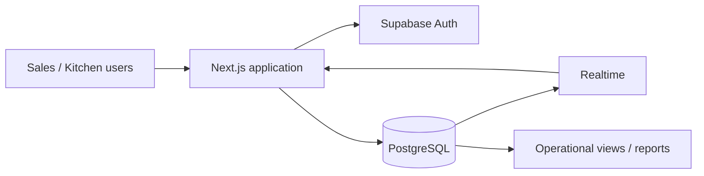

# BakeryOps — Order & Production Management

A privacy-safe engineering case study derived from a production web application built collaboratively for a real artisan-bakery client.

The original system replaced manual order tracking with a shared workflow for sales, kitchen production, payments, reservations and operational reporting.

> **Why the production repository is not public**
> The original codebase was created for a real paying client and historically contained customer data, commercial pricing, client branding and deployment-specific configuration. This repository intentionally publishes only anonymized documentation and representative technical artifacts.

## What I worked on

My work included:

- translating non-technical client needs into technical requirements;
- developing and maintaining the application with the team;
- structuring operational data and order workflows;
- automating work that had previously been tracked manually;
- iterating on the delivered system after real-world use and client feedback.

## Stack

- Next.js / React / TypeScript
- Supabase Auth + PostgreSQL
- Row Level Security (RLS)
- Supabase Realtime
- Tailwind CSS

## Product scope

The production system included:

- customer and product management;
- order lifecycle and order-number tracking;
- reservations convertible into orders;
- partial/full payment history;
- bundles, discounts and shipping costs;
- daily/weekly production planning;
- calendar views;
- expense/revenue summaries;
- realtime operational updates;
- role-aware access for administration, sales and kitchen users;
- printable order and production views.

## Architecture

A few design decisions:

- order items keep a price snapshot so old orders do not change when the catalog changes;
- database triggers maintain derived order and payment totals;
- realtime subscriptions synchronize operational views;
- authorization is enforced at the database layer with RLS rather than relying only on UI checks.

## Representative technical artifacts

- [Case study](docs/case-study.md) — problem, workflow and representative engineering decisions
- [Data model](docs/data-model.md) — simplified relational model and invariants
- [Engineering notes](docs/engineering-notes.md) — examples of cross-layer decisions and debugging
- [Architecture](docs/architecture.md)
- [Security & privacy](docs/security.md)
- [Operational order visibility](examples/order-visibility.ts)
- [Order-total trigger](examples/order-total-trigger.sql)
- [Payment ledger + aggregate triggers](examples/payment-ledger.sql)
- [Role-based RLS hardening](examples/rls-hardening.sql)
- [Synthetic demo data](examples/demo_seed.sql)

## Privacy

No real customer records, phone numbers, addresses, client branding, production credentials or business-specific pricing are published here.

## Status

The client system itself was a real delivered application. This repository is **not a deployable copy of the client's production system**; it is a deliberately limited portfolio case study that focuses on the engineering work while respecting client privacy and ownership.
