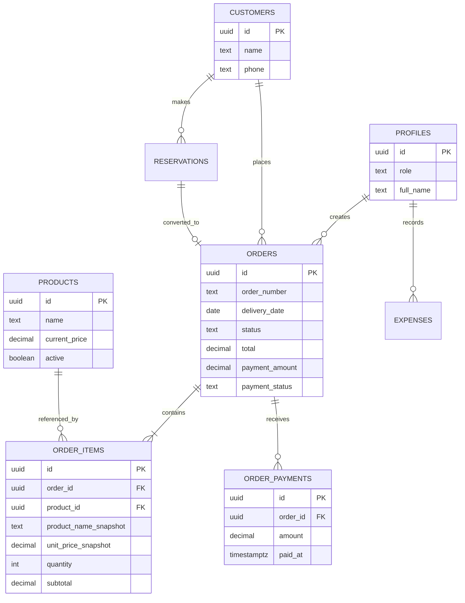

# Data model

The production system used PostgreSQL through Supabase. This diagram is intentionally simplified and anonymized.

## Price snapshots

`ORDER_ITEMS` stores the product name and unit price used at the moment of the sale.

That is intentional duplication. A bakery may change its current catalog price tomorrow, but that should not alter the financial history of an order already placed today.

## Aggregate + ledger pattern

Payments eventually evolved into two representations:

- `ORDER_PAYMENTS` preserves individual payment events;
- aggregate fields on `ORDERS` make operational dashboards cheap to query.

Database triggers keep those representations synchronized.

## Reservations

Reservations are modeled separately from confirmed orders because the business workflow treats them differently. A reservation can later be converted into an order without forcing incomplete reservations to satisfy every invariant of a confirmed order.

## Authorization boundary

Application roles live in `PROFILES`, linked to Supabase Auth users. Row Level Security uses those profiles to enforce read/write capabilities close to the database.
